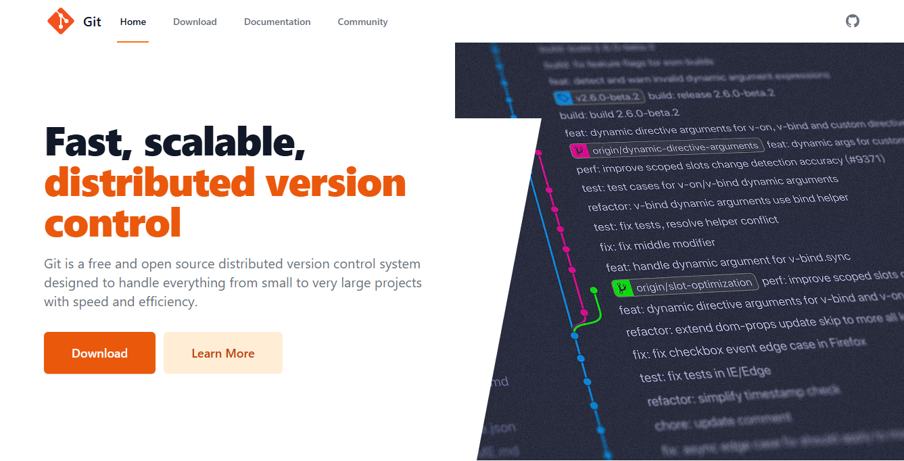

# GitX



GitX is a modern, responsive website for the Git version control system built with Express.js, HTML, CSS, and JavaScript.

## Table of Contents

- [Overview](#overview)
- [Features](#features)
- [Project Structure](#project-structure)
- [Getting Started](#getting-started)
  - [Prerequisites](#prerequisites)
  - [Installation](#installation)
- [Pages](#pages)
- [Technologies Used](#technologies-used)
- [Error Handling](#error-handling)
- [Contributing](#contributing)
- [License](#license)
- [Acknowledgments](#acknowledgments)


## Overview

GitX is a responsive website for Git, the distributed version control system. It features a clean, modern design using Tailwind CSS and Alpine.js for interactivity. The site includes pages for home, download, documentation, and community engagement.

## Features

- Responsive design using Tailwind CSS
- Interactive UI components with Alpine.js
- Server-side routing with Express.js
- Download options for multiple operating systems
- Comprehensive documentation section
- Community engagement resources
- Error handling with custom 404 and access denied pages

## Project Structure

```
GitX/
├── public/               # Static assets
│   ├── css/              # CSS files including Tailwind
│   ├── js/               # JavaScript files
│   ├── images/           # Image assets
│   └── templates/        # HTML templates
├── src/                  # Server-side code
│   └── app.js            # Express application
└── package.json          # Project dependencies
```

## Getting Started

### Prerequisites

- Node.js (v14 or higher)
- npm (v6 or higher)

### Installation

1. Clone the repository
```bash
git clone https://github.com/GitCoder052023/GitX.git
cd GitX
```

2. Install dependencies
```bash
npm i
```

3. Start the development server
```bash
npm run dev
```

4. Open your browser and navigate to `http://localhost:3000`

## Pages

- **Home** (`/`): Landing page with an overview of Git
- **Download** (`/download`): Download options for different operating systems
- **Documentation** (`/documentation`): Comprehensive guides and references
- **Community** (`/community`): Resources for community engagement

## Technologies Used

- [Express.js](https://expressjs.com/) - Web application framework
- [Tailwind CSS](https://tailwindcss.com/) - Utility-first CSS framework
- [Alpine.js](https://alpinejs.dev/) - Lightweight JavaScript framework for interactivity

## Error Handling

The website includes custom error pages:
- 404 Not Found page for non-existent routes
- Access Denied page for restricted directories

## Contributing

We welcome contributions! Please read the [CONTRIBUTING.md](https://github.com/GitCoder052023/GitX/blob/main/CONTRIBUTING.md) file for details on our contribution guidelines.

1. Fork the repository
2. Create your feature branch (`git checkout -b feature/amazing-feature`)
3. Commit your changes (`git commit -m 'Add some amazing feature'`)
4. Push to the branch (`git push origin feature/amazing-feature`)
5. Open a Pull Request

## License

This project is licensed under the MIT License - see the LICENSE file for details.

## Acknowledgments

- Git project for inspiration
- Tailwind CSS for the styling framework
- Alpine.js for the interactive components